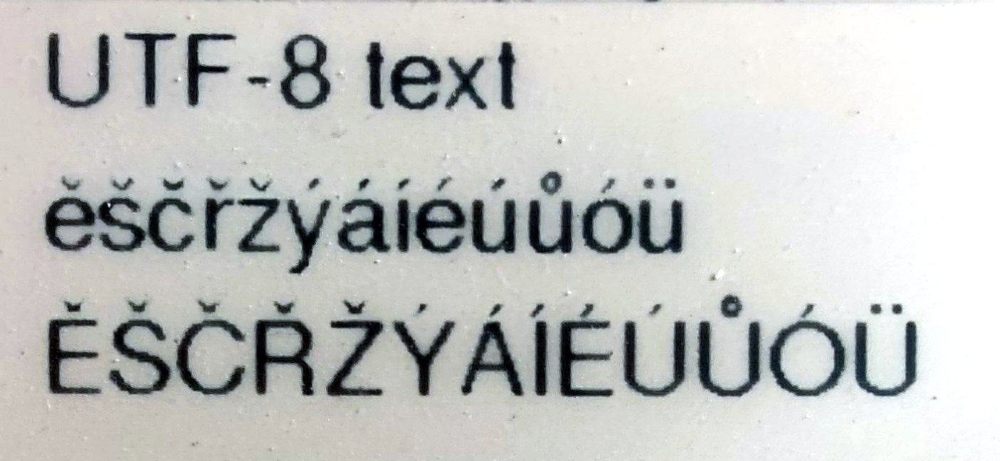

Ukázka použití českých znaků ve fontech zkonvertovanjých pomocí upraveného fontconvert8 s GxEPD2

Je to klon z následující stránky, kde najdete i detailní popis a postup použití v Arduinu:
https://www.sigmdel.ca/michel/program/misc/gfxfont_8bit_en.html

Do zdrojáků aplikace si vložte obsah tohoto adresáře.
Do INO souboru přidejte

```cpp
#include "FreeSans15pt8b.h"
#include "gfxlatin2.h"
#include "decodeutf8.h"
```

Když chcete vytisknout UTF-8 text, nakopírujte ho do textového pole a zavolejte na něj funkci utf8tocp(). Obsah pole se in-place překóduje na ISO-8859-2 s posunutými znaky >0x80 o -32 pozic. Tedy odpovídá fontu vygenerovanému z fontconvert8.

```cpp
display.setFont(&FreeSans15pt8b);
display.setTextColor(GxEPD_BLACK);
display.setCursor( 30, 60 ); 
display.print( "UTF-8 text" ); 

char text[100];
strcpy( text, "ěščřžýáíéúůóü" );
utf8tocp( text ); 
display.setCursor( 30, 100 ); 
display.print( text ); 

strcpy( text, "ĚŠČŘŽÝÁÍÉÚŮÓÜ" );
utf8tocp( text );
display.setCursor( 30, 140 ); 
display.print( text ); 
```

A výsledek vypadá třeba takto:


